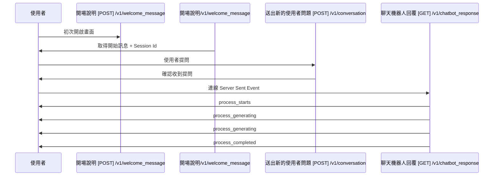

# HR小精靈需求規格書

- [HR小精靈需求規格書](#hr小精靈需求規格書)
- [版本歷程](#版本歷程)
- [畫面](#畫面)
  - [上方導覽列](#上方導覽列)
  - [對話框](#對話框)
    - [對話流程](#對話流程)
- [API](#api)
  - [開場說明 \[POST\] /v1/welcome\_message](#開場說明-post-v1welcome_message)
    - [Request](#request)
      - [Header](#header)
      - [Body](#body)
    - [Response](#response)
  - [送出新的使用者問題 \[POST\] /v1/conversation](#送出新的使用者問題-post-v1conversation)
    - [Request](#request-1)
      - [Header](#header-1)
      - [Body](#body-1)
    - [Response](#response-1)
    - [](#)
  - [聊天機器人回覆 \[GET\] /v1/chatbot\_response](#聊天機器人回覆-get-v1chatbot_response)
    - [Request](#request-2)
      - [Header](#header-2)
      - [Body](#body-2)
    - [Response](#response-2)
  - [機器人回覆回饋 \[POST\] /v1/response\_feedback](#機器人回覆回饋-post-v1response_feedback)
    - [Request](#request-3)
      - [Header](#header-3)
      - [Body](#body-3)
    - [Response](#response-3)

# 版本歷程
| 版本  | 異動內容     | 異動人員 | 異動日期   |
| ----- | ------------ | -------- | ---------- |
| 1.0.0 | 初版         | 林庭羽   | 2024/06/17 |
| 1.0.1 | 新增畫面邏輯 | 黃添賜   | 2024/06/18 |

# 畫面


## 上方導覽列
| 序號  | 欄位       | Type | 資料輸入欄位 | 資料輸出欄位 | 顯示邏輯 | Action             | 備註               |
| :---: | ---------- | ---- | ------------ | ------------ | -------- | ------------------ | ------------------ |
|   1   | 使用者資訊 | Menu |              |              | Fixed    | 點擊後顯示下拉選單 | 下拉選單項目: 登出 |


## 對話框

### 對話流程



| 序號  | 欄位           | Type     | 資料輸入欄位                                                           | 資料輸出欄位                                                                               | 顯示邏輯                                                                      | Action                                                                | 備註               |
| :---: | -------------- | -------- | ---------------------------------------------------------------------- | ------------------------------------------------------------------------------------------ | ----------------------------------------------------------------------------- | --------------------------------------------------------------------- | ------------------ |
|   2   | 使用者訊息     | Text     | 7:文字輸入框                                                           |                                                                                            |                                                                               |                                                                       |                    |
|   3   | 機器人回覆訊息 | Text     | [聊天機器人回覆 Response](#聊天機器人回覆-get-v1chatbot_response).data |                                                                                            | 依據[聊天機器人回覆 Response](#聊天機器人回覆-get-v1chatbot_response)逐字顯示 |                                                                       |                    |
|   4   | 正向回饋按鈕   | Button   |                                                                        | [機器人回覆回饋 Request](#機器人回覆回饋-post-v1response_feedback).feedback.[index]:"good" |                                                                               |                                                                       |                    |
|   5   | 負向回饋按鈕   | Button   |                                                                        | [機器人回覆回饋 Request](#機器人回覆回饋-post-v1response_feedback).feedback.[index]:"bad"  |                                                                               |                                                                       |                    |
|   6   | 文字輸入框     | TextArea |                                                                        | [送出新的使用者問題 Request](#送出新的使用者問題-post-v1conversation).data.user_submit     | 送出後清除內容                                                                |                                                                       |                    |
|   7   | 送出           | Button   |                                                                        |                                                                                            | 未輸入文字無法送出                                                            | 點擊後打[送出新的使用者問題](#送出新的使用者問題-post-v1conversation) | 須帶入歷史對話內容 |
|       |                |          |                                                                        |                                                                                            |                                                                               | 接續打[聊天機器人回覆](#聊天機器人回覆-get-v1chatbot_response)        |                    |

# API

## 開場說明 [POST] /v1/welcome_message

### Request
#### Header

| 欄位名稱      | 輸入資料         | 描述            |
| ------------- | ---------------- | --------------- |
| Authorization | JWT Token        | 產險 SAML Token |
| Accept        | application/json |                 |

#### Body

```json
{}
```

### Response

```json
{
   "msg":"嗨~~歡迎使用HR小精靈服務!
          詢問時建議一次問一個問題，越精準單一的提問，應答效果會越好喔!
          由於目前小精靈還在POC測試階段，請注意回覆上可能有錯漏之情形
          小精靈可以協助解答的問題範圍如下 : 
          請假規則 : 特休假、公假、公傷病假、事假、普通傷病假(病假)、婚假、喪假、
                    生理假、產檢假、產假、陪產檢及陪產假、家庭照顧假、留職停薪、其他
          差勤系統 : 差勤管理、居家辦公申請、加值班申請、外出申請、其他
          勞健保 : 健保投保退保、員工退休金
          代理人 : 主管管理、職務代理、請假代理
          其他 : 福團理賠、結婚生育津貼、服務證明、請調申請",
    "session_id": "938c2cc0dcc05f2b68c4287040cfcf71"
}
```

## 送出新的使用者問題 [POST] /v1/conversation

### Request
#### Header

| 欄位名稱      | 輸入資料         | 描述            |
| ------------- | ---------------- | --------------- |
| Authorization | JWT Token        | 產險 SAML Token |
| Accept        | application/json |                 |

#### Body

```json
{
    "session_id": "938c2cc0dcc05f2b68c4287040cfcf71",
    "data":
    {
        "user_submit": "你好，我想問一年可以請多少天病假",
        "user_submit_epochtime": "1718064549001", // ms
        "conversation_history": 
        {
            "conversation":[
                // 使用者問題 , chatbot回答
                ["小精靈你好", "你好，有什麼我可以幫助你的嗎？"], //第一個對話
                ["可以告訴我最近的麥當勞要怎麼走嗎", "不好意思，這個問題與差勤、請假無關"], //第二個對話
                ["可以告訴我要怎麼請病假嗎", "你可以到iHR系統上去申請"] //第三個對話
            ],
            "conversation_epochtime":
            [
               //submit time  //response start//response end
                ["1718064450004", "1718064470002", "1718064473002"],
                ["1718064500003", "1718064530001", "1718064532003"], 
                ["1718064535002", "1718064540006", "1718064545009"]
            ],
            "conversation_info": //要提供的markdown
            [
                "", 
                "",
                "<https://www.google.com/> 參見p1, p2"
            ]
        }
    }
}
```

### Response

```json
{}
```
###

## 聊天機器人回覆 [GET] /v1/chatbot_response

### Request
#### Header

| 欄位名稱      | 輸入資料            | 描述            |
| ------------- | ------------------- | --------------- |
| Authorization | JWT Token           | 產險 SAML Token |
| Accept        | `text/event-stream` |                 |


#### Body

```json
{
    "session_id": "938c2cc0dcc05f2b68c4287040cfcf71",
}
```

### Response 

```json
<!-- example1 -->
{
    "status": "process_starts", // 有process_generating, process_completed
    "session_id": "938c2cc0dcc05f2b68c4287040cfcf71",
    "epochtime": "1718064550000" 
}
```

```json
<!-- example2 -->
{
    "status": "process_generating",
    "session_id": "938c2cc0dcc05f2b68c4287040cfcf71",
    "epochtime": "1718064551000",
    "data": "根據"
}
```

```json
<!-- example3 -->
 {
    "status": "process_generating",
    "session_id": "938c2cc0dcc05f2b68c4287040cfcf71",
    "epochtime": "1718064551002",
    "data": "差勤管理"
}	
```

```json
<!-- example4 -->
{
    "status": "process_completed", 
    "session_id": "938c2cc0dcc05f2b68c4287040cfcf71",
    "epochtime": "171806491023",
    "data": "根據差勤管理的規定，一年有5天有薪病假。",
    "info": "<https://www.google.com/> 參見p3, p4" //markdown格式
}	
``` 

## 機器人回覆回饋 [POST] /v1/response_feedback

### Request
#### Header

| 欄位名稱      | 輸入資料         | 描述            |
| ------------- | ---------------- | --------------- |
| Authorization | JWT Token        | 產險 SAML Token |
| Accept        | application/json |                 |

#### Body

```json
{
    "session_id": "938c2cc0dcc05f2b68c4287040cfcf71",
    "feedback": {
        "0": "good",
        "2": "bad",
    }
}
```

### Response

```json
{}
```


